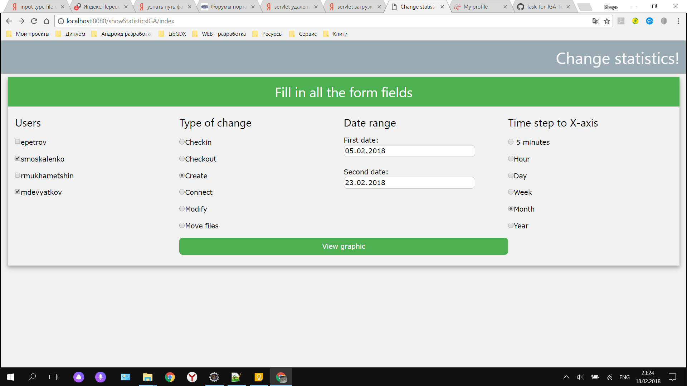
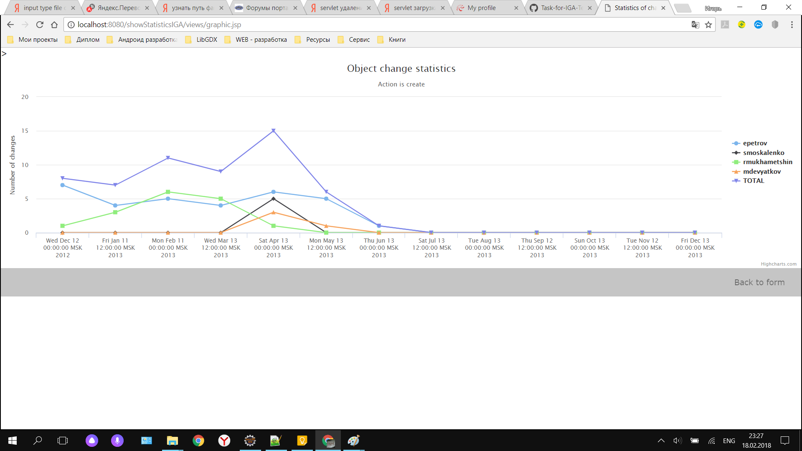

# Task-for-IGA-Technology
Find and collect statistics by using Java, JS, JSP and CSS

index.jsp is the main user interface file. The form is filled in: users, change type, date range and generalization type(hour, day, month) are selected. Users using the java block are taken from the users file.txt.

app.entities.Users.a java class with static methods for searching user names from a user file.txt and output them to index.jsp

app.servlets.ChangeServlet.a java servlet using post-query collects data from the form index.jsp and passes it for processing to the changes class.java. And also performs a redirect to the graph display page.

app.entities.Changes.java - class with static methods to create an array with which to create a graph. The array is built according to the form data obtained by the ChangeServlet servlet.java

wviews / graphic.jsp page displaying the charts working on the script and HighCharts. Java blocks are used in which static variables are processed. And then it is compiled into JSON format for correct operation.

web.xml-connects the ChangeServlet servlet.java and the configuration of the default page

    
    

